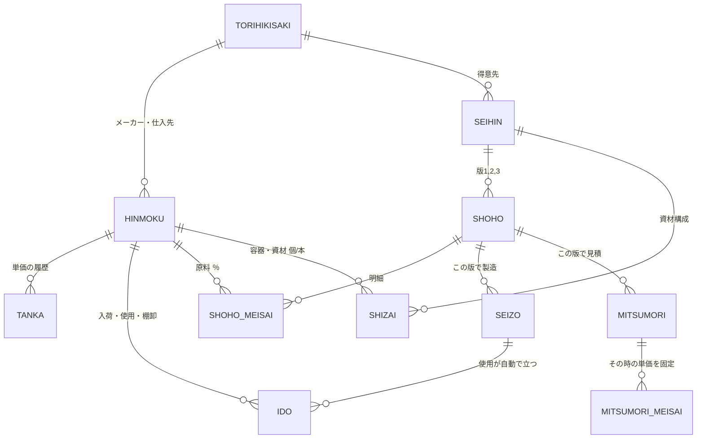

# データ構成（ER図）v2

**目的：関係者に「ここまでできる」を見せる試作。** 製造管理まではやらない。在庫が分かり、処方とつながり、見積が出ればよい。

## v1からの変更点

| v1 | v2 | 理由 |
|---|---|---|
| 原料だけ | **品目**＝原料＋容器＋資材を1つの表に | 容器も在庫で減る。同じ仕組みで扱える |
| 全部を同じ扱い | 品目ごとに「**在庫を数える**」「**期限を記録する**」の○× | 精製水は在庫を数えない。容器は期限がない |
| 入出庫の区分が5種類 | **入荷・使用・棚卸**の3つだけ | 予備の余り・使いすぎ・NGは記録しない。**棚卸で数えた数を入れれば、差が自動で合う** |
| 月次締め表あり | なし | 試作には不要 |
| メーカー／発注先／得意先が別々の表 | **取引先**1つ（区分で分ける） | 表を減らす |
| 見積の容器代は手入力 | 製品に**資材構成**（1本あたり容器1・箱1・カートン1/40）を持つ | 見積の容器代が単価から出る。製造すると容器在庫も減る |

## 全体図

9つの表と、明細が2つ。

## 各表

### 品目（HINMOKU）— 原料・容器・資材
| 項目 | 例 | メモ |
|---|---|---|
| コード ★ | 0232 / Y0012 | 原料は今の4桁のまま。容器・資材は別の番号帯にする |
| 区分 | 原料 / 容器 / 資材 | 資材＝箱・ラベル・カートンなど |
| 名称 | 濃グリセリン | |
| 表示名称・INCI名 | グリセリン / GLYCERIN | 原料だけ |
| メーカー・仕入先 | → 取引先 | |
| 入目 | 18kg / 100個 | 発注の単位 |
| 在庫単位 | kg / 個 | |
| **在庫を数える** | ○ / × | ×（精製水など）は製造しても在庫が動かない |
| **期限を記録する** | ○ / × | 容器は基本× |
| 有効 | ○ / × | 廃番でも過去の処方・見積のために消さない |

### 単価（TANKA）— 上書きしない
品目・適用日・単価（在庫単位あたり）・元の価格と単位・メモ。
値上げは**行を足す**。いちばん新しい適用日の単価を使う。

### 在庫の動き（IDO）— 足すだけ
| 項目 | メモ |
|---|---|
| 日付・品目 | |
| 区分 | **入荷**（＋）／**使用**（−、製造から自動）／**棚卸**（差を自動計算） |
| 数量 | |
| ロット・使用期限 | 入荷のときだけ。期限は「期限を記録する＝○」の品目だけ入力欄が出る |
| 製造 | 「使用」のとき、どの製造か |

- **在庫＝動きの合計。**在庫数そのものは保存しない
- **棚卸**：数えた実数を入れると、「実数−帳簿」を棚卸行として足す。予備の余り・使いすぎ・NGはここに吸収されて、在庫が実物と合う
- **期限**：入荷ごとに記録し、一覧には「近い期限」と「期限切れ間近」の印を出す（どのロットから使ったかまでは追わない）

### 取引先（TORIHIKISAKI）
名称・区分（メーカー／仕入先／得意先）。表記揺れ（日光ケミカルズ／日光ｹﾐｶﾙｽﾞ）はここで1つにまとめる。

### 製品（SEIHIN）と資材構成（SHIZAI）
| 製品 | 製品名・得意先・充填量(g) |
|---|---|
| 資材構成 | 品目（容器・資材）・1本あたりの数（カートンは 1/40）・**支給**（○なら見積は0円、在庫も動かさない） |

### 処方（SHOHO）と処方明細（SHOHO_MEISAI）
| 処方 | 製品・版・状態（下書き／確定）・日付 |
|---|---|
| 処方明細 | 品目（原料）・配合％ |

処方は直さず**版を増やす**（「複製して新しい版」）。製造と見積は版を指すので、過去は動かない。合計％は常に表示（今のExcelの例は100.1%）。

### 製造（SEIZO）
日付・処方（版）・仕込量(kg)・充填本数・製造ロット。
登録すると「使用」行を自動で作る：
- 原料：仕込量 × 配合％
- 容器・資材：充填本数 × 1本あたりの数

取り消すと、その製造の「使用」行も消える。

### 見積（MITSUMORI）と見積明細（MITSUMORI_MEISAI）
| 見積 | 番号・日付・得意先・処方（版）・本数・充填量・ロス率・加工費（製造・充填・仕上げ）・送料・掛率・状態（下書き／発行済） |
|---|---|
| 見積明細 | 品目（原料＋容器・資材）・数量・**単価**・金額 |

**発行すると、その時の単価を明細に固定する。**値上がりしても出した見積は変わらない。「今の単価で計算し直す」は別ボタン。

## 今のExcelとの対応

| 今 | これから |
|---|---|
| 原料マスタ.xls | 品目（原料）＋ 取引先 ＋ 単価 |
| 備考欄の値上げメモ | 単価の履歴 |
| 原価計算シート 左（コード・％） | 処方 ＋ 処方明細 |
| 原価計算シート 右（充填量・ロット・加工費） | 製品 ＋ 見積 |
| 容器「支給」・カートン代の手計算 | 資材構成 |
| （なし） | 在庫の動き・製造 |

## 保存

試作なので **`原料データ.xlsx` 1ファイル、表1つ＝シート1枚**。Excelで開けばそのまま読める。
同時編集の対策は試作ではやらない。この形なら、本番でデータベースに移しても表がそのままテーブルになる。

## やらないこと（試作の範囲外）

ロットごとの引き当て（先入れ先出し）・使いすぎ／NGの記録・発注・月次締め・権限管理。
